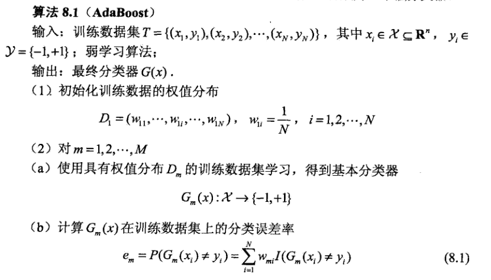
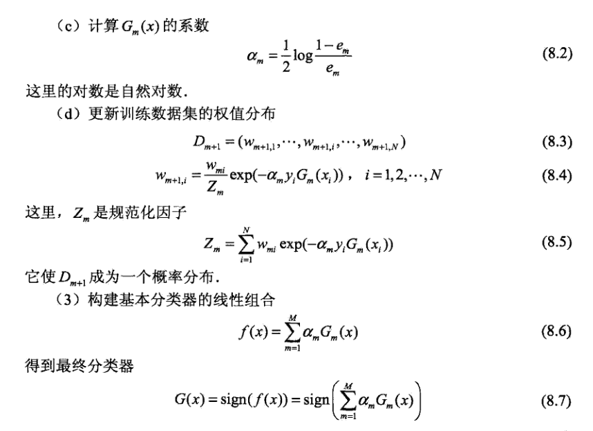

提升算法：

对于一堆数据，我们制定一个规则将其分为两类不是不可行，只是这样会造成很高的错误率。并且没有哪一个单一规则就可以将所有数据进行正确分类。定义：仅具有单一规则就将数据分为两类的这种分类器称为弱分类器。对一个训练数据集来说，存在多个弱分类器。就好比开会需要定义一个最佳方案，有几个提案，但是都没有达到预期效果，这些提案各自就是一个弱分类器。要想达到预期效果，就需要采用表决法选出稍微好点的若干个提案组合起来，效果最好的起的作用大，效果差点的起的作用小，但是把它们结合在一起就达到了预期效果就满足要求了。这样以权重结合的多个提案就是一个强分类器。

所有会有两个问题：

1、 每一个弱分类器如何产生？ 2、最后的强分类器如何选举得到？

解：

1、每个分类器都与各个样本的权重有关，且后一个分类器总是基于前一个分类器那些被错分的样本得到，每一轮训练分类器时，都会把前一轮分类器中错分样本的权重增加，而正确分类样本的权重就适当降低。

2、根据每个分类器可以得到样本分类的错误率，据此错误率就可以计算出该弱分类器对应的重要性系数。强分类器不断的组合进带有权重的弱分类器，直到该强分类器的误差率为0或者达到了规定的弱分类器个数为止。强分类器中重要性高的是那些样本错分率低的弱分类器。

其算法过程：参考《统计学习方法》算法8.1

注释：（1）、初始化训练数据的各个样本权重，一开始均等。N是样本个数。

（2）、M是迭代次数。

（a）在每一轮迭代中先训练出基本的弱分类器针对每个属性值对应的极差，以及给定的步长，可以得到属性值增量，据此设定不同的属性值阈值情况。用阈值来对训练集标签分类，可以得到分类错误率。选出错误率最低的分类器作为这一轮的弱分类器。

（b）到弱分类器的误差率。也是这一轮所有分类器中最小的错误率。

（c）根据公式得到该分类器的重要性系数。

（d）结合数据集原标签、分类器分类标签、系数、上一轮权重向量 调整出新的样本权重向量值。

（3）、将新的弱分类器按照系数乘以分类标签值的结果加入到强分类器中。用sign()函数来加以衡量，分类错误的样本概率加和除以总样本数，直到整个强分类器的误差率为零，或者整个迭代次数达到规定值为止，就得到了按重要性加总的强分类器。

后记：提升算法的思路要屡清楚其实并不很难，可能在具体写代码的时候，因为我们大多数人已经将现代还给体育老师了，所以矩阵运算、横向量纵向量傻傻分不清楚。除了能把数中代码码出来，也是时候补充下mat/matrix/array/.T/.transpose()/multiply() 巴拉巴拉

