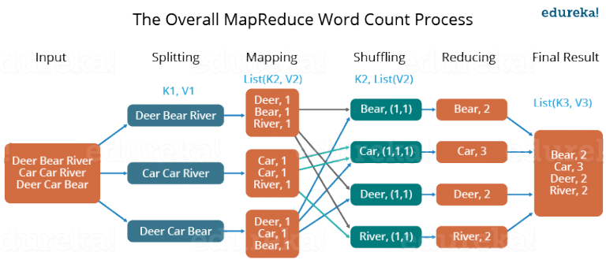

MapReduce的一个非常形象的例子：

一个工人要制作一小瓶混合酱，他会分别将辣椒、洋葱、蒜剁成碎块。然后把这些碎块和在一起，捣碎，就做好了一份混合酱。

但假如他要开工厂，那么就需要很多不同的工人，都进行剁碎块这个操作，但是每个工人只负责一堆相应的蔬菜。每个工人将自己那一部分蔬菜剁好了就将碎块推进一个大缸里，如果只是制作混合酱，那么一口缸就够了，等所有的碎块集齐，这口缸把食材捣碎搅拌，就生成了一大份混合酱。但是如果要分别制作辣椒酱、洋葱酱、蒜蓉，那么就需要三口缸，在每个工人把碎块推进缸里之前，他需要被指定具体的缸，等每口缸都把食材集齐，就可以分别捣碎搅拌生成三分酱了。

这个例子形象的说明了，在需要处理大数据的时候，采用mapreduce把任务分配到不同的服务器去做，而map的过程是每个服务器针对不同的输入做相同的工作，reduce就是把map产生的中间结果再加以处理就生成了最终我们需要的结果。

关于mapreduce的一个入门实例就是wordCount。它需要实现的工作是针对输入的文本，能够计算每个出现的单词的个数。

例如句子**Dear, Bear, River, Car, Car, River, Deer, Car, Bear** 

当然先对句子用逗号分隔，再对得到的单词数组进行分片，每三个单词一个分片，一个分片对应一个map。这时候输入的键值对，键是分片编号或者其它什么你自定义的标号，值是每个分片的具体文本，例如{1:[Dear,Bear,River]}。

然后mapper对自己的内容进行处理，map()函数需要用户自定义，从而得到中间键值对结果。因为是要计算每个单词的数量，所以对出现的单词都得到一个键值对，键是单词，值是1，表示该单词数量一个。

对所有map的中间结果进行shufftle操作，其中包括对结果的分区，区的个数就是到时候reduce任务的个数。针对wordCount这个具体事例，将相同的键值对放进同一个区。shufftle还包括排序、合并操作，它会根据需求按照键或者值排序，合并其实等价于reduce操作，如果不是wordCount，而是其它的操作，那么可能在最终的reduce之前将每个区的键值对根据键合并一下（需求不同，不一定同一个区的键都相同）。

reducer将取出mapper产生的中间结果，按照用户自定义的reduce函数，将相同键对应的值加总，就得到最终的结果，每个单词以及对应的数量。

其次，我还按照《机器学习实战》中对大数据的讲解这一章，写了简单的入门例子，求均值以及方差。当然有很大的不足，也就是我并没有下载安装Hadoop的环境，且是在windows系统上模拟了它的简易流程。后续时间充裕，再来花时间学习这个知识点的其它实例。